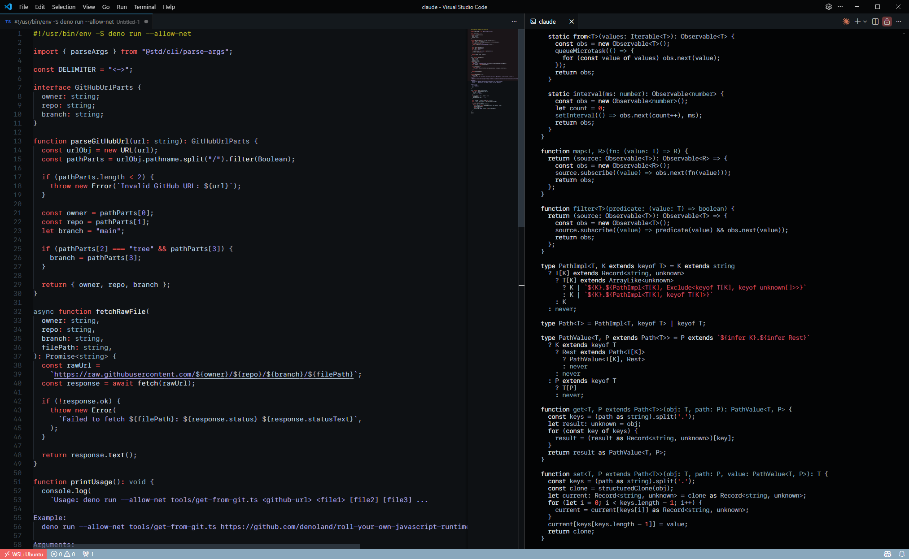

# Redshift Dark Theme

A dark theme for VS Code.

## Preview



## Installation

```bash
git clone https://github.com/giovanni-d/redshift-dark-theme.git ~/.vscode/extensions/redshift-dark-theme
```

Reload VS Code, then open Command Palette (`Ctrl+Shift+P`) and select `Preferences: Color Theme` → `Redshift Dark`.
